# AgentOps Mission Control

An operational control surface that turns raw agent telemetry into evidence-backed incidents for failed, slow, stale, over-budget, and approval-blocked runs.

**Portfolio role:** Agentic AI & LLM Systems Specialist
**Status:** core and evaluation complete; Vercel preview pending verification
**Safety:** replay-first, read-only analysis, zero external mutations

## What this proves

- Typed FastAPI and Pydantic contracts for agent telemetry.
- Deterministic reliability rules before any model-authored explanation.
- Idempotent run creation and content-hashed evidence.
- OpenTelemetry spans that can be exported to Langfuse through OTLP.
- A useful replay mode when a model, trace provider, or database is unavailable.



## Three-minute walkthrough

1. Open the demo and choose `failed`, `slow`, `stale`, `over_budget`, or `approval_bottleneck`.
2. Run the analysis and inspect which exact telemetry facts triggered each incident.
3. Re-run with the same idempotency key to see the original record returned safely.
4. Open `/docs` or the Postman collection to inspect the typed API.
5. Configure an OTLP endpoint locally to inspect the `agentops.analyze` span in Langfuse.

## Verified evaluation

| Check | Result |
|---|---:|
| Seeded failure classes detected | 5/5 |
| Healthy run false positives | 0 |
| Idempotent replay | Pass |
| Conflicting idempotency input | Blocked |
| External mutations | 0 |

Full evidence: [evaluations/REPORT.md](evaluations/REPORT.md).

## Run locally

```powershell
uv sync
uv run uvicorn server:app --reload
uv run python -m unittest discover -s tests -v
```

Open `http://127.0.0.1:8000`, `/docs`, or `/openapi.json`.

Optional Langfuse export uses standard OpenTelemetry variables:

```text
OTEL_EXPORTER_OTLP_ENDPOINT=
OTEL_EXPORTER_OTLP_HEADERS=
```

## API

- `GET /api/v1/health`
- `GET /api/v1/capabilities`
- `POST /api/v1/telemetry/runs`
- `GET /api/v1/runs/{run_id}`
- `GET /openapi.json`

The generated OpenAPI document is the contract source of truth. See [SYSTEM-GUIDE.md](SYSTEM-GUIDE.md) for the architecture, alternatives, security model, deployment path, and limitations.

## Repository map

- `agentops.py`: schemas, replay fixtures, rules, idempotency, and tracing.
- `server.py`: API and responsive demo.
- `tests/`: golden and boundary checks.
- `diagrams/`: Mermaid, SVG, PNG, and editable Excalidraw assets.
- `postman/`: generated API collection and secret-free environment.
- `evaluations/`: published proof and acceptance status.

The original fleet scanner remains available in `app.py` and `scanner.py`; the AgentOps API extends it without changing those existing commands.
