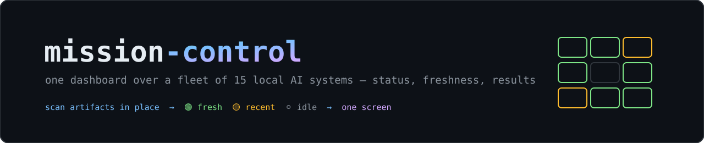
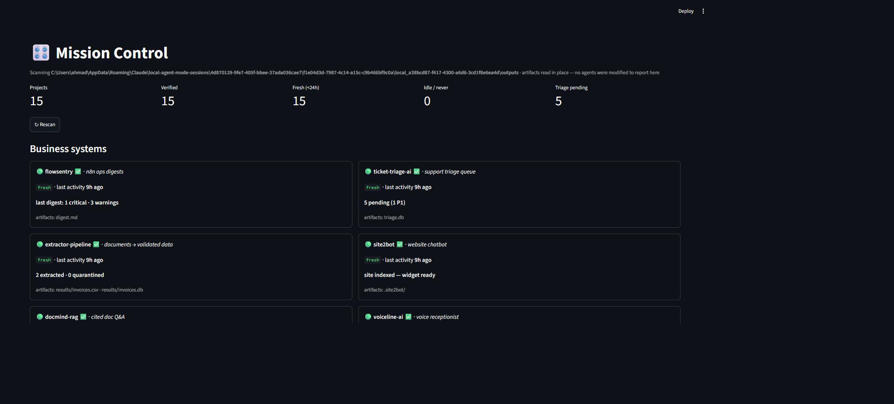
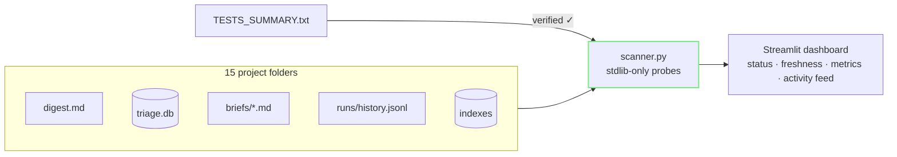

<p align="center"></p>

<p align="center">
  
  
  
  
  
</p>

**mission-control** is the answer to the question every fleet of AI agents
eventually raises: *"where do I see all of this?"* One Streamlit dashboard
over 15 local AI systems — status, freshness, and the metric that matters for
each — built by **scanning the artifacts every project already writes**
(digests, queues, briefs, run histories, indexes). Zero changes to the agents
themselves.

## Live (real run on the full fleet)

<p align="center"></p>

*Unedited: 15 projects, 15 verified, live metrics — FlowSentry's incident counts, the triage queue's P1s, extraction totals — all scanned from artifacts in place.*

```text
[✓] flowsentry             fresh   last digest: 1 critical · 3 warnings
[✓] ticket-triage-ai       fresh   5 pending (1 P1)
[✓] extractor-pipeline     fresh   2 extracted · 0 quarantined
[✓] mcp-business-server    fresh   11 overdue invoices in demo DB
[✓] mini-evolve            fresh   fitness 419 over 3 gens
[✓] compactrag             fresh   22 atomic QA facts
...15 projects, one screen
```

## How it works



Each project gets a probe that knows its evidence: FlowSentry's digest is
parsed for critical/warning counts, the triage queue is queried straight from
SQLite, mini-evolve's fitness trajectory comes from `history.jsonl`, RAG
projects report index sizes. Freshness is honest mtime math: 🟢 <24h,
🟡 <7d, ⚪ idle, ⚫ never run — and ✅ means the project passed its recorded
end-to-end verification run.

## Quickstart

```bash
pip install -r requirements.txt

# clone next to your project folders (or set MISSION_ROOT)
streamlit run app.py
```

| Variable | Default | Purpose |
|---|---|---|
| `MISSION_ROOT` | parent folder of this repo | Where the project folders live |

## Extending it

Adding project #16 is one entry in `PROJECTS` plus a ~10-line probe that
reads whatever that project writes. For deeper, per-call observability
(tokens, latencies, prompt traces) the right tool is a purpose-built LLM
tracer like Langfuse — mission-control deliberately sits one level up:
*outcomes and freshness across the whole fleet, at a glance.*

---

<p align="center">Built by <a href="https://github.com/syedahmad0786">Ahmad Bukhari</a> — AI &amp; Automation Architect · <i>agentic systems that run real businesses, not just demos</i></p>
