# AgentOps Mission Control — System Guide

## 1. Business problem and user

Agent teams often discover failures through user complaints, scattered logs, or a provider bill. An operator needs one record that answers: what failed, which facts prove it, what is the likely impact, and who should own the response.

The current user is an AI operations or platform owner. The portfolio preview uses synthetic telemetry and accepts bounded custom telemetry; it never reaches into a live customer system.

## 2. Responsibilities

| Component | Responsibility | Boundary |
|---|---|---|
| Telemetry Normalizer | Validate and normalize run records | Rejects invalid time order, budgets, status, size, and step counts |
| Incident Detector | Apply explicit failure, latency, staleness, spend, and approval rules | Does not invent incidents from prose |
| Operations Reporter | Assemble incident, impact, owner, confidence, and evidence | Read-only; cannot restart or cancel a run |
| Trace Adapter | Emit execution attributes through OpenTelemetry | Disabled unless an OTLP endpoint is configured |

## 3. End-to-end data flow

1. A caller submits a named replay or a typed custom telemetry set.
2. Pydantic rejects malformed or unsafe input.
3. Deterministic rules evaluate every run.
4. The service hashes the normalized source record and writes an in-process run record.
5. The response contains incidents, evidence, usage, and a zero-mutation declaration.
6. When OTLP is configured, the service emits scenario, mode, and incident-count span attributes.

## 4. API contracts

`POST /api/v1/telemetry/runs` accepts `RunRequest`:

| Field | Meaning |
|---|---|
| `scenario` | One golden replay or `custom` |
| `input` | Custom `runs` only when scenario is `custom` |
| `mode` | `replay` in the public deployment |
| `idempotency_key` | 8–120 characters; replays matching input and rejects conflicts |

The response is a `RunRecord` with agent steps, incidents, evidence hash, usage, errors, status, and timestamps. FastAPI generates `/openapi.json`; Postman artifacts are derived from that contract.

## 5. State, memory, and persistence

The current preview uses a process-local dictionary because the main proof is deterministic detection, not database administration. This is reliable in local and single-process contract tests. Serverless instances can be recycled, so cross-instance run retrieval is not claimed.

The production seam is a `portfolio_agentops.runs` table in the shared portfolio Postgres project. Add it when a portfolio database URL is supplied; keep the idempotency key unique and the source hash immutable.

## 6. Security, approvals, and failure boundaries

- Five public runs per IP per day.
- Maximum 12 reported agent steps and 90-second latency input bound.
- Pydantic validation at the trust boundary.
- No credentials, command execution, run restart, cancellation, or client mutation tool.
- Content hashes make evidence changes detectable.
- OTLP credentials stay in environment variables.
- Replay mode remains available when Langfuse or another provider is unavailable.

## 7. Deployment and observability

The FastAPI application is deployed as a Vercel Python function. Pull requests create previews; tests run before the exact preview is promoted. Preview verification includes health, OpenAPI, one healthy run, every seeded failure class, a duplicate request, and a 390-pixel browser journey.

OpenTelemetry is the vendor-neutral transport. Langfuse receives spans through its OTLP endpoint when configured. No tracing dependency is required to understand the response because the incident evidence is returned in the API itself.

## 8. Cost controls

Replay mode uses no model tokens. The system exposes cost and budget as telemetry, not as inferred narrative. Public request and step limits bound compute. A future model-written incident explanation must remain behind the same deterministic findings and the $5 monthly inference reserve.

## 9. Alternatives considered

| Decision | Selected | Why here | Alternative and reason not selected |
|---|---|---|---|
| API | REST/JSON | Browser and Postman friendly; each incident is a stable typed resource | GraphQL adds query machinery without a flexible client need; gRPC complicates the public browser demo |
| Framework | FastAPI | Pydantic validation and generated OpenAPI are core proof | Flask would require manual schema and documentation plumbing |
| Detection | Python rules | Failure thresholds must be reproducible and testable | An LLM detector could produce inconsistent operational alarms |
| Telemetry | OpenTelemetry OTLP | One standard can feed Langfuse or another backend | A Langfuse-only client would couple the system to one vendor |
| Persistence | Process-local in preview | Smallest honest implementation for deterministic replay | Neon becomes necessary when cross-instance history or teams use the service |
| Kubernetes | None | Vercel is the deployed runtime | Manifests with no exercised cluster would be misleading proof |

## 10. Agent collaboration

The components are called agents in the product view, but operational truth is established by code. A future model may summarize an incident after the reporter has a complete evidence set; it cannot change the rule outcome.

## 11. Known limitations and production requirements

- Current history is not durable across serverless instance recycling.
- Thresholds are versioned constants, not tenant-specific policies.
- No live agent runtime is connected in the public preview.
- Langfuse trace receipt requires user-provided OTLP credentials and must be verified separately.
- Production use requires a database, authentication, retention policy, alert ownership, calibrated thresholds, and rollback-tested adapters.
